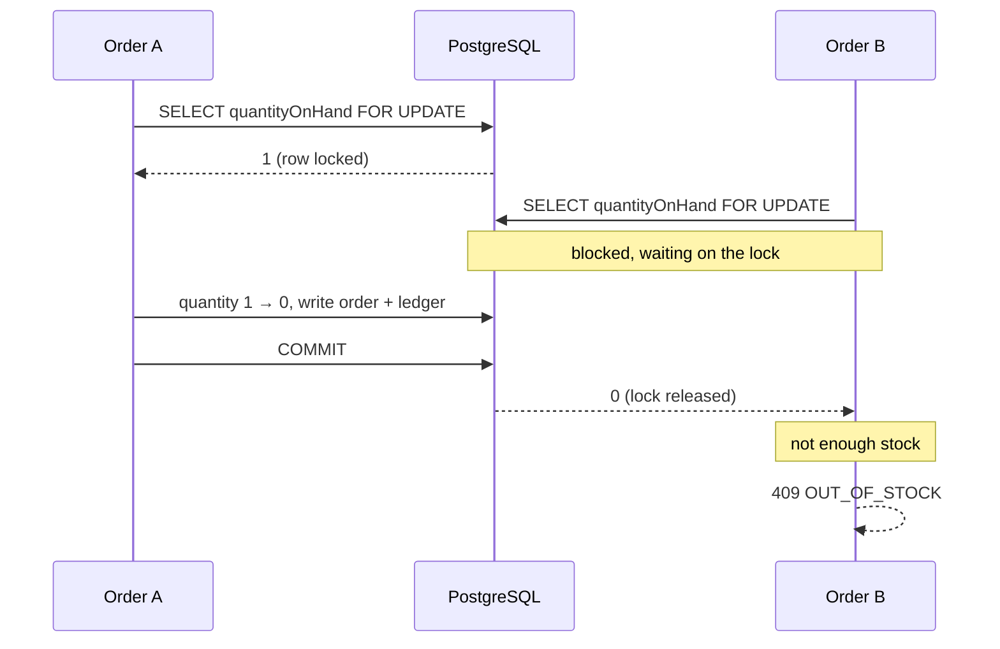
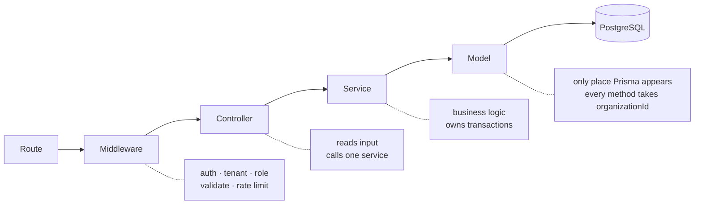

<div align="center">

# StockLedger

**Multi-tenant inventory and order management for small retailers,
built so that overselling is impossible.**

[](https://nodejs.org)
[](https://expressjs.com)
[](https://postgresql.org)
[](https://prisma.io)
[](https://react.dev)
[](#testing)

[Live demo](https://stock-edger.vercel.app) &nbsp;·&nbsp;
[Architecture](docs/architecture.md) &nbsp;·&nbsp;
[API](docs/api.md) &nbsp;·&nbsp;
[Database](docs/database.md) &nbsp;·&nbsp;
[Load test](docs/load-test.md)

</div>

<!-- Add the walkthrough here once recorded, then delete this comment:

-->

---

## Try it

**[stock-edger.vercel.app](https://stock-edger.vercel.app)** — all three accounts use `password123`

| Sign in as  | Email                    | What you can do                                        |
| ----------- | ------------------------ | ------------------------------------------------------ |
| **Owner**   | `asha@stockledger.test`  | Everything, including members and the concurrency demo |
| **Manager** | `imran@stockledger.test` | Catalogue, stock, orders, analytics                    |
| **Staff**   | `rahul@stockledger.test` | Take orders. No pricing, no stock, no analytics        |

Nine months of seeded trading: 100 products, 226 variants, ~1,500 orders.

> Hosted on a free tier, so the first request may take 30 seconds to wake the server.

---

## The problem this solves

Two customers buy the last unit at the same instant. Placing an order is three
steps — read the stock, decide, write the decrement — and two requests can
interleave between them. Both read `1`, both decide yes, both write. You have
sold one unit twice, nothing errors, and you find out weeks later.



`placeOrder` sorts the variant ids, takes `SELECT … FOR UPDATE` on those rows,
checks every line against the locked quantities, then writes the order, its
lines, a ledger movement per line and an audit row in a single transaction. One
short line rolls the whole thing back.

**`/demo/concurrency`** fires fifty simultaneous orders at a product holding one
unit, and lets you switch the lock off:

|                   | Created | Refused | Final stock |
| ----------------- | ------: | ------: | ----------: |
| With the row lock |   **1** |  **49** |       **0** |
| Without it        |  **50** |       0 |     **−49** |

Same fifty requests. Same code path, minus the lock.

---

## What it does

Retailers sign up, create an organization and invite their team. Managers build
a catalogue, receive stock and correct it. Staff take orders across the counter.
Every change to stock is written to an append-only ledger with a running
balance, so any number on screen traces back to the movement that produced it.

<table>
<tr><td valign="top" width="50%">

**Accounts and tenancy**

- Register, sign in, refresh token rotation
- Reuse detection revokes the whole token family
- Owner, manager and staff roles
- Copyable invite links, shown once
- Strict isolation — a foreign row is `404`, not `403`

**Catalogue**

- Categories, products, variants
- Search, category and status filters, pagination
- Image upload to Cloudinary

</td><td valign="top" width="50%">

**Stock and orders**

- Append-only ledger with a running balance
- Receive stock; adjustments require a reason
- Row-locked order placement
- Idempotent creation via `Idempotency-Key`
- Cancellation returns stock through the ledger

**Money and reporting**

- Razorpay test payments, webhook signatures verified
- PDF invoices generated on download
- Dashboard over nine months of data

</td></tr>
</table>

---

## Architecture



A controller reads validated input, calls one service and sends the result. A
service holds the business logic and owns transactions, and never touches `req`
or `res` — which is why the seeder and the tests call the same functions the
HTTP layer does.

**ESLint enforces the layering** rather than trusting anyone to remember it:
Prisma may only be imported inside `models/`, controllers may not import models,
and services may not import Express.

<details>
<summary><b>Project layout</b></summary>

```
server/
  config/       env (Zod-validated), prisma client, constants
  routes/       paths and middleware only
  controllers/  request in, one service call, response out
  services/     business logic, transactions
  models/       the only Prisma consumers
  validators/   one Zod file per resource
  utils/        money, pagination, tokens, invoice pdf
  prisma/       schema and migrations
  tests/        124 tests against a real database

frontend/src/
  api/          axios instance and one query-hook file per resource
  components/   ui/ (hand-written), layout/, shared/
  pages/        one folder per screen
  store/        zustand — client state only
```

</details>

---

## Quick start

```bash
git clone https://github.com/mars-alien/StockLedger.git && cd StockLedger
npm run setup
cp .env.example server/.env          # set DATABASE_URL and JWT_ACCESS_SECRET
npm --prefix server run db:migrate
npm --prefix server run seed
npm run dev
```

App on **http://localhost:5173**, API on **http://localhost:5000**. Vite proxies
`/api`, so both sit on one origin in development exactly as they do in
production.

Cloudinary and Razorpay keys are optional — without them those two endpoints
answer `503` and everything else works.

<details>
<summary><b>Environment variables</b></summary>

`config/env.js` validates everything with Zod and refuses to start if anything
is missing or malformed. Copy `.env.example` to `server/.env`, and again to
`server/.env.test` with a database name ending in `_test`.

| Variable                          | Required | Notes                                                      |
| --------------------------------- | :------: | ---------------------------------------------------------- |
| `DATABASE_URL`                    |   yes    | On Supabase, the transaction pooler with `?pgbouncer=true` |
| `DIRECT_URL`                      |          | Session pooler, for migrations. Same as above locally      |
| `JWT_ACCESS_SECRET`               |   yes    | At least 32 characters                                     |
| `ACCESS_TOKEN_TTL`                |          | Default `15m`                                              |
| `REFRESH_TOKEN_TTL_DAYS`          |          | Default `7`                                                |
| `CORS_ORIGINS`                    |   yes    | Comma separated. `*` is rejected at boot                   |
| `APP_URL`                         |   yes    | Where invitation links point                               |
| `CLOUDINARY_*`                    |          | Empty disables image upload                                |
| `RAZORPAY_KEY_ID` / `_KEY_SECRET` |          | Empty disables payments                                    |
| `RAZORPAY_WEBHOOK_SECRET`         |          | The webhook's secret, not the API secret                   |
| `TRUST_PROXY`                     |          | Number of proxy hops. `2` behind Vercel → Render           |
| `DEMO_ENDPOINTS_ENABLED`          |          | Exposes the deliberately unsafe demo endpoint              |
| `RATE_LIMIT_ENABLED`              |          | Only ever `false` for a load test                          |

</details>

---

## Measured, not claimed

autocannon, 50 connections, 20 seconds, local PostgreSQL. Full method and
reasoning in [docs/load-test.md](docs/load-test.md).

| Scenario                         | Throughput |    p50 |    p95 |      p99 | Errors |
| -------------------------------- | ---------: | -----: | -----: | -------: | -----: |
| `GET /api/products`              |   1,138 /s |  41 ms |  58 ms |    65 ms |      0 |
| `POST /api/orders` — one variant |     106 /s | 447 ms | 889 ms | 2,027 ms |      0 |
| `POST /api/orders` — 40 variants |     409 /s | 114 ms | 207 ms |   254 ms |      0 |

The two write rows run **identical code**. The only difference is whether all
fifty connections are buying the same variant. Spreading across forty gives
**3.9× the throughput and p50 drops from 447 ms to 114 ms** — the gap is lock
contention, nothing else. The write path is not slow, it is serialised on
purpose, and only against orders touching the same stock.

---

## Testing

```bash
npm test
```

**124 tests against a real PostgreSQL**, not mocks. Migrations are applied to
the test database automatically, and the suite refuses to run against a database
whose name does not end in `_test`.

| Suite            | Proves                                                               |
| ---------------- | -------------------------------------------------------------------- |
| Tenant isolation | Every list and get-by-id from the wrong organization returns nothing |
| Overselling      | Fifty parallel orders against one unit give exactly one success      |
| Idempotency      | Replay, key reuse, in-progress, expiry                               |
| Token rotation   | Reuse revokes the family; two browser tabs do not                    |
| Ledger           | `balanceAfter` reconstructs, including under parallel writes         |

---

## Notable decisions

<details open>
<summary><b>Money is stored as integers</b></summary>

Paise in an `Int` column. Binary floating point cannot represent 0.1 exactly and
the error compounds across order lines. Tax is a rate in basis points so the
rate is an integer too, applied once to the subtotal rather than per line.

</details>

<details>
<summary><b>Stock leaves at placement, not at payment</b></summary>

There is no reservation window and no expiry job. Staff enter orders for a
customer standing at the counter, so the goods have physically gone.
Reserve-then-confirm exists to stop anonymous strangers holding inventory
hostage on a public checkout, which is not this product. If it ever grew one,
that is when reservation would become the right answer.

</details>

<details>
<summary><b><code>READ COMMITTED</code> is enough</b></summary>

The anomaly that matters is a lost update, and `READ COMMITTED` does not prevent
it on its own. The explicit `FOR UPDATE` lock does. The correctness argument
rests on the lock, not the isolation level. `SERIALIZABLE` would also be correct
but pays for it with retry storms under exactly the contention this system is
built to handle.

</details>

<details>
<summary><b>A unique constraint replaces the distributed lock</b></summary>

`POST /api/orders` inserts the idempotency key row **before doing any work**. A
duplicate insert fails instantly with Prisma's `P2002`, and that failure _is_
the detection. The database already provides atomic uniqueness, so nothing else
needs to. A stored refusal replays as a refusal — the same key asking the same
question gets the same answer, not a second attempt at the work.

</details>

<details>
<summary><b>Refresh tokens rotate, and reuse kills the family</b></summary>

Presenting an already rotated token revokes every token descended from that
sign-in. A ten second grace window distinguishes two browser tabs racing from an
actual replay, and the whole read-decide-rotate sequence runs under a row lock —
without it, two tabs could both rotate the same token and leave a family with
two live tokens.

</details>

<details>
<summary><b>Fulfilment and payment are separate fields</b></summary>

`status` is `PLACED` or `CANCELLED`; `paymentStatus` is the only field that
speaks for money. Two columns that can each claim an order is paid will
eventually disagree, and a payment webhook is exactly the thing that makes them.

</details>

<details>
<summary><b>One origin in production</b></summary>

Vercel serves the client and rewrites `/api` to Render, so the browser only ever
sees one origin. That keeps the refresh cookie at `SameSite=Strict`, which a
genuinely split deployment would break, and removes CORS from the deployment
entirely.

</details>

---

## Security

- helmet, with a content security policy naming Razorpay and Cloudinary explicitly
- CORS from an allowlist; `*` fails validation at boot
- Rate limiting globally, and harder on sign-in
- Zod validation on every body, query, param and the idempotency header
- bcrypt at cost 12; only _hashes_ of refresh and invite tokens are stored
- Razorpay signatures verified against the raw request bytes, compared in constant time
- No stack traces in production responses; a request id is always returned
- Uploads capped at 2 MB and restricted to JPEG, PNG and WebP
- `npm audit --audit-level=high` clean

---

<div align="center">

Built by [mars-alien](https://github.com/mars-alien) · MIT

</div>
